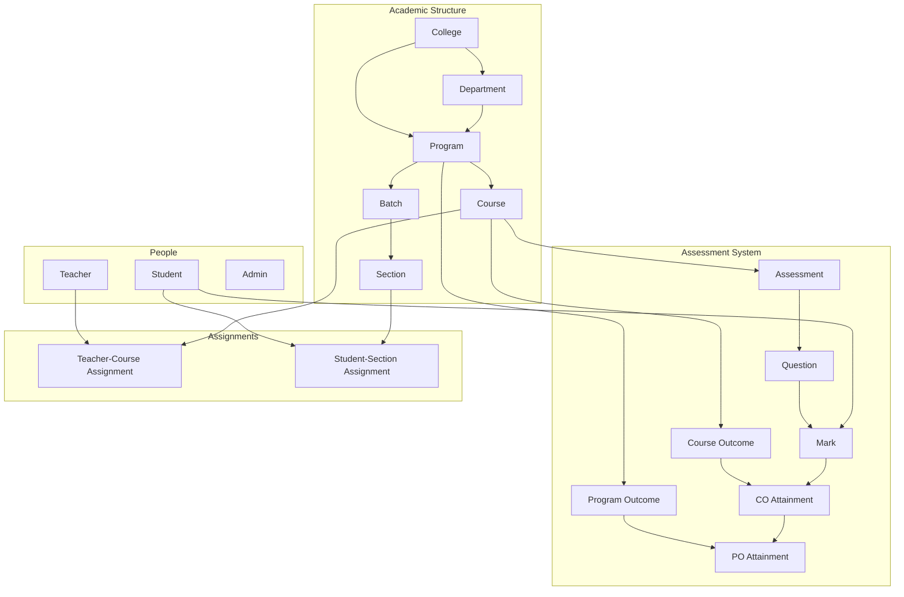
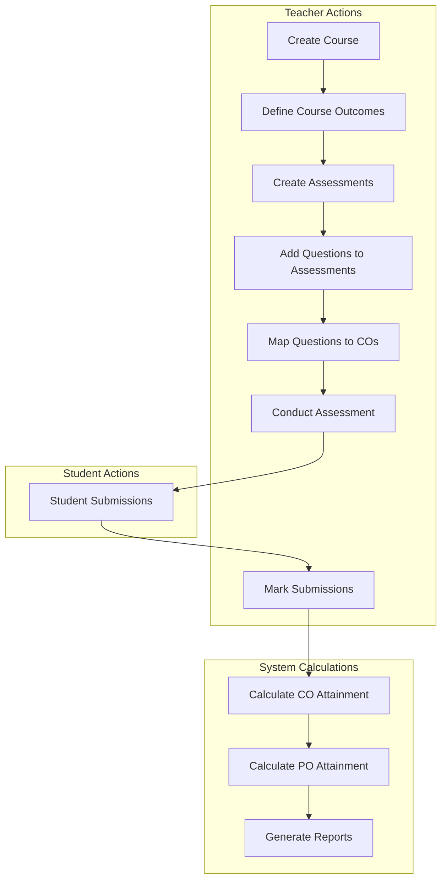
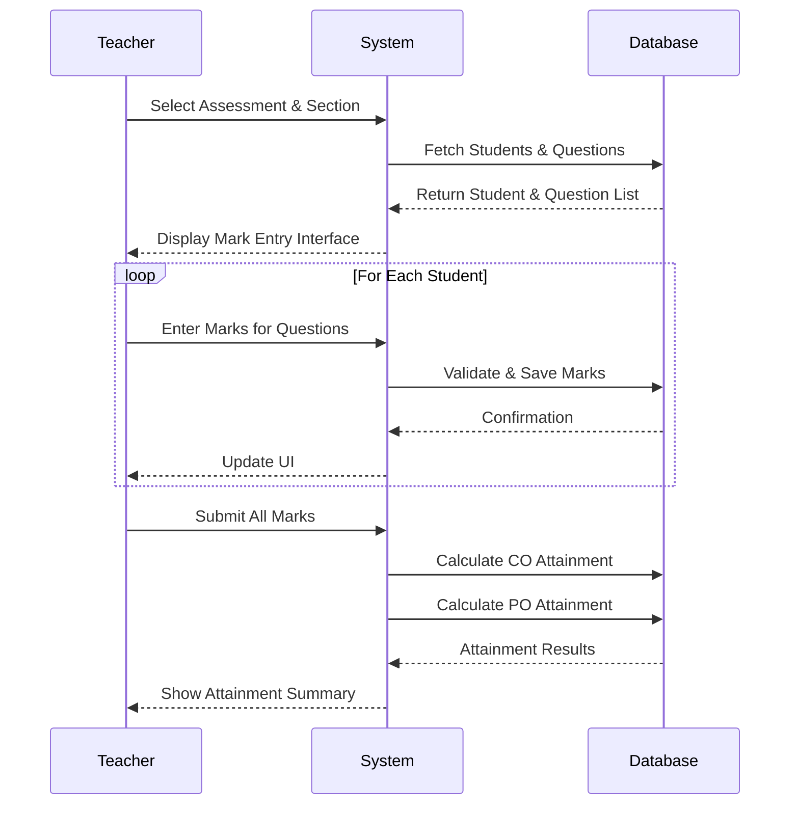
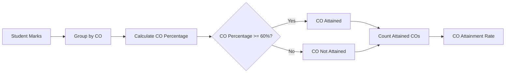
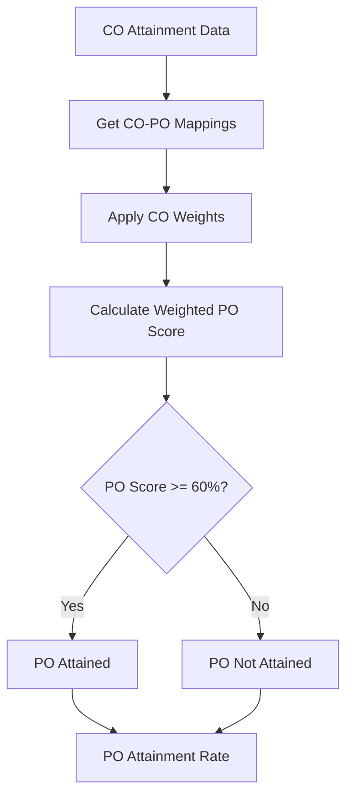
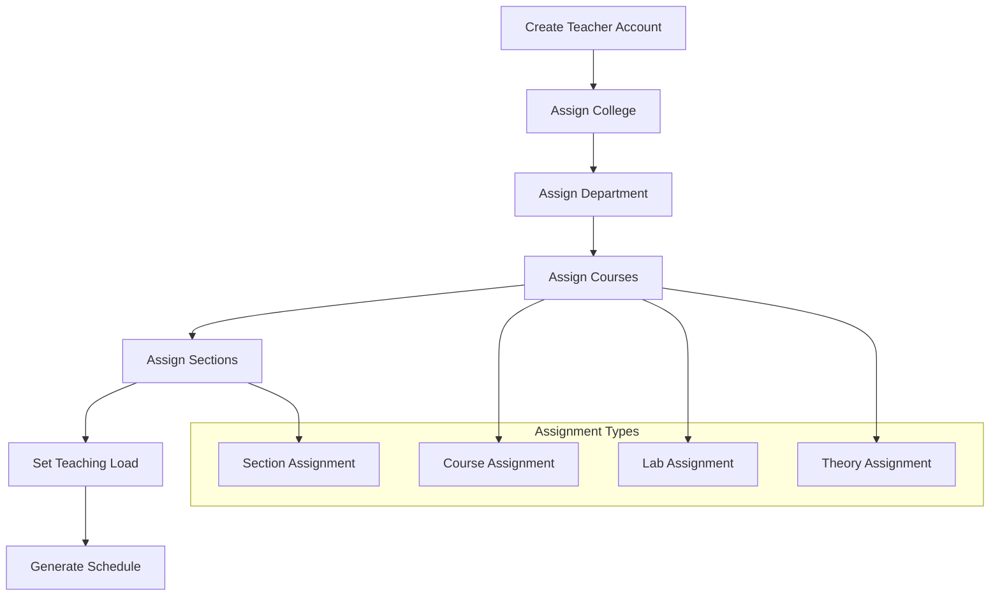

# Assessment System Overview

## Table of Contents
1. [System Architecture](#system-architecture)
2. [Data Models & Relationships](#data-models--relationships)
3. [Assessment Flow](#assessment-flow)
4. [Marking System](#marking-system)
5. [CO Attainment](#co-attainment)
6. [PO Attainment](#po-attainment)
7. [Teacher Assignment](#teacher-assignment)
8. [Filtering Logic](#filtering-logic)
9. [API Endpoints](#api-endpoints)
10. [Frontend Components](#frontend-components)

---

## System Architecture



---

## Data Models & Relationships

### Core Academic Entities

#### College
```typescript
interface College {
  id: string;
  name: string;
  code: string;
  description?: string;
  isActive: boolean;
  createdAt: Date;
  updatedAt: Date;
}
```

#### Program
```typescript
interface Program {
  id: string;
  name: string;
  code: string;
  collegeId: string;
  departmentId?: string;
  isActive: boolean;
  createdAt: Date;
  updatedAt: Date;
}
```

#### Department
```typescript
interface Department {
  id: string;
  name: string;
  code: string;
  collegeId: string;
  isActive: boolean;
  createdAt: Date;
  updatedAt: Date;
}
```

#### Batch
```typescript
interface Batch {
  id: string;
  name: string;
  startYear: number;
  endYear: number;
  programId: string;
  isActive: boolean;
  createdAt: Date;
  updatedAt: Date;
}
```

#### Section
```typescript
interface Section {
  id: string;
  name: string;
  batchId: string;
  isActive: boolean;
  createdAt: Date;
  updatedAt: Date;
  _count?: {
    students: number;
  };
}
```

#### Course
```typescript
interface Course {
  id: string;
  name: string;
  code: string;
  description?: string;
  credits: number;
  programId: string;
  isActive: boolean;
  createdAt: Date;
  updatedAt: Date;
  _count?: {
    courseOutcomes: number;
    assessments: number;
  };
}
```

### Assessment System Entities

#### Course Outcome (CO)
```typescript
interface CourseOutcome {
  id: string;
  code: string;
  description: string;
  courseId: string;
  isActive: boolean;
  createdAt: Date;
  updatedAt: Date;
}
```

#### Program Outcome (PO)
```typescript
interface ProgramOutcome {
  id: string;
  code: string;
  description: string;
  programId: string;
  isActive: boolean;
  createdAt: Date;
  updatedAt: Date;
}
```

#### CO-PO Mapping
```typescript
interface COPOMapping {
  id: string;
  courseOutcomeId: string;
  programOutcomeId: string;
  weight: number; // Contribution weight (0-1)
  createdAt: Date;
}
```

#### Assessment
```typescript
interface Assessment {
  id: string;
  title: string;
  description?: string;
  type: 'EXAM' | 'QUIZ' | 'ASSIGNMENT' | 'PROJECT' | 'LAB';
  maxMarks: number;
  passingMarks: number;
  weight: number; // Weight in overall course assessment
  courseId: string;
  isActive: boolean;
  createdAt: Date;
  updatedAt: Date;
  _count?: {
    questions: number;
    marks: number;
  };
}
```

#### Question
```typescript
interface Question {
  id: string;
  text: string;
  type: 'MCQ' | 'SHORT_ANSWER' | 'LONG_ANSWER' | 'NUMERICAL';
  maxMarks: number;
  courseOutcomeId: string;
  assessmentId: string;
  isActive: boolean;
  createdAt: Date;
  updatedAt: Date;
  _count?: {
    marks: number;
  };
}
```

#### Mark
```typescript
interface Mark {
  id: string;
  obtainedMarks: number;
  maxMarks: number;
  studentId: string;
  questionId: string;
  assessmentId: string;
  isPassed: boolean;
  remarks?: string;
  createdAt: Date;
  updatedAt: Date;
  student?: {
    id: string;
    name: string;
    studentId: string;
  };
  question?: {
    id: string;
    text: string;
    maxMarks: number;
    courseOutcome?: {
      id: string;
      code: string;
    };
  };
}
```

---

## Assessment Flow



### Assessment Creation Process

1. **Course Setup**
   - Create course with basic details
   - Define course outcomes (COs)
   - Map COs to program outcomes (POs)

2. **Assessment Design**
   - Create assessments (exams, quizzes, assignments)
   - Set maximum marks and passing criteria
   - Define assessment weight in overall course

3. **Question Creation**
   - Add questions to assessments
   - Map each question to specific CO
   - Set question type and maximum marks

4. **Assessment Execution**
   - Publish assessments to students
   - Students submit answers
   - Teachers evaluate submissions

5. **Marking & Attainment**
   - Enter marks for each question
   - Calculate CO attainment per student
   - Aggregate to PO attainment

---

## Marking System

### Mark Entry Flow



### Mark Calculation Logic

#### Question Level
```typescript
interface QuestionMark {
  questionId: string;
  maxMarks: number;
  obtainedMarks: number;
  percentage: number; // (obtainedMarks / maxMarks) * 100
  isPassed: boolean;
}
```

#### Assessment Level
```typescript
interface AssessmentMark {
  assessmentId: string;
  totalMaxMarks: number;
  totalObtainedMarks: number;
  percentage: number;
  isPassed: boolean;
  questions: QuestionMark[];
}
```

#### Course Level
```typescript
interface CourseMark {
  courseId: string;
  totalMaxMarks: number;
  totalObtainedMarks: number;
  percentage: number;
  grade: string;
  isPassed: boolean;
  assessments: AssessmentMark[];
}
```

---

## CO Attainment

### CO Attainment Calculation



### CO Attainment Formula

```typescript
interface COAttainmentCalculation {
  courseOutcomeId: string;
  totalQuestions: number;
  totalMaxMarks: number;
  totalObtainedMarks: number;
  averagePercentage: number;
  isAttained: boolean;
  studentCount: number;
  attainedStudentCount: number;
  attainmentRate: number; // (attainedStudentCount / studentCount) * 100
}

// CO Attainment Logic
function calculateCOAttainment(marks: Mark[], courseOutcomeId: string): COAttainmentCalculation {
  const coMarks = marks.filter(mark => 
    mark.question?.courseOutcomeId === courseOutcomeId
  );
  
  const totalMaxMarks = coMarks.reduce((sum, mark) => sum + mark.maxMarks, 0);
  const totalObtainedMarks = coMarks.reduce((sum, mark) => sum + mark.obtainedMarks, 0);
  const averagePercentage = totalMaxMarks > 0 ? (totalObtainedMarks / totalMaxMarks) * 100 : 0;
  
  // CO is attained if average percentage >= 60%
  const isAttained = averagePercentage >= 60;
  
  // Count students who attained this CO
  const studentMarks = groupByStudent(coMarks);
  const attainedStudentCount = studentMarks.filter(student => 
    calculateStudentCOPercentage(student.marks, courseOutcomeId) >= 60
  ).length;
  
  return {
    courseOutcomeId,
    totalQuestions: coMarks.length,
    totalMaxMarks,
    totalObtainedMarks,
    averagePercentage,
    isAttained,
    studentCount: studentMarks.length,
    attainedStudentCount,
    attainmentRate: (attainedStudentCount / studentMarks.length) * 100
  };
}
```

### Student CO Attainment

```typescript
interface StudentCOAttainment {
  studentId: string;
  courseOutcomeId: string;
  totalMaxMarks: number;
  totalObtainedMarks: number;
  percentage: number;
  isAttained: boolean;
}

function calculateStudentCOPercentage(
  marks: Mark[], 
  courseOutcomeId: string
): number {
  const coMarks = marks.filter(mark => 
    mark.question?.courseOutcomeId === courseOutcomeId
  );
  
  const totalMaxMarks = coMarks.reduce((sum, mark) => sum + mark.maxMarks, 0);
  const totalObtainedMarks = coMarks.reduce((sum, mark) => sum + mark.obtainedMarks, 0);
  
  return totalMaxMarks > 0 ? (totalObtainedMarks / totalMaxMarks) * 100 : 0;
}
```

### Section CO Attainment

```typescript
interface SectionCOAttainment {
  sectionId: string;
  courseOutcomeId: string;
  totalStudents: number;
  attainedStudents: number;
  attainmentRate: number;
  averagePercentage: number;
}

function calculateSectionCOAttainment(
  students: Student[],
  marks: Mark[],
  courseOutcomeId: string
): SectionCOAttainment {
  const sectionStudents = students.map(student => ({
    studentId: student.id,
    coPercentage: calculateStudentCOPercentage(
      marks.filter(mark => mark.studentId === student.id),
      courseOutcomeId
    )
  }));
  
  const totalStudents = sectionStudents.length;
  const attainedStudents = sectionStudents.filter(s => s.coPercentage >= 60).length;
  const attainmentRate = (attainedStudents / totalStudents) * 100;
  const averagePercentage = sectionStudents.reduce((sum, s) => sum + s.coPercentage, 0) / totalStudents;
  
  return {
    sectionId: students[0]?.sectionId,
    courseOutcomeId,
    totalStudents,
    attainedStudents,
    attainmentRate,
    averagePercentage
  };
}
```

### Course CO Attainment

```typescript
interface CourseCOAttainment {
  courseId: string;
  courseOutcomeId: string;
  totalStudents: number;
  attainedStudents: number;
  attainmentRate: number;
  averagePercentage: number;
  sections: SectionCOAttainment[];
}

function calculateCourseCOAttainment(
  course: Course,
  sections: Section[],
  students: Student[],
  marks: Mark[],
  courseOutcomeId: string
): CourseCOAttainment {
  const sectionAttainments = sections.map(section => 
    calculateSectionCOAttainment(
      students.filter(s => s.sectionId === section.id),
      marks,
      courseOutcomeId
    )
  );
  
  const totalStudents = sectionAttainments.reduce((sum, s) => sum + s.totalStudents, 0);
  const attainedStudents = sectionAttainments.reduce((sum, s) => sum + s.attainedStudents, 0);
  const attainmentRate = (attainedStudents / totalStudents) * 100;
  const averagePercentage = sectionAttainments.reduce((sum, s) => sum + s.averagePercentage, 0) / sectionAttainments.length;
  
  return {
    courseId: course.id,
    courseOutcomeId,
    totalStudents,
    attainedStudents,
    attainmentRate,
    averagePercentage,
    sections: sectionAttainments
  };
}
```

---

## PO Attainment

### PO Attainment Calculation



### PO Attainment Formula

```typescript
interface POAttainmentCalculation {
  programOutcomeId: string;
  totalWeight: number;
  weightedScore: number;
  weightedPercentage: number;
  isAttained: boolean;
  contributingCOs: {
    courseOutcomeId: string;
    weight: number;
    attainmentRate: number;
    contribution: number;
  }[];
  studentCount: number;
  attainedStudentCount: number;
  attainmentRate: number;
}

function calculatePOAttainment(
  coAttainments: COAttainmentCalculation[],
  coPOMappings: COPOMapping[],
  programOutcomeId: string
): POAttainmentCalculation {
  // Get COs that map to this PO
  const relevantCOs = coPOMappings.filter(mapping => 
    mapping.programOutcomeId === programOutcomeId
  );
  
  // Calculate weighted contribution from each CO
  const contributingCOs = relevantCOs.map(mapping => {
    const coAttainment = coAttainments.find(co => 
      co.courseOutcomeId === mapping.courseOutcomeId
    );
    
    return {
      courseOutcomeId: mapping.courseOutcomeId,
      weight: mapping.weight,
      attainmentRate: coAttainment?.attainmentRate || 0,
      contribution: (coAttainment?.attainmentRate || 0) * mapping.weight
    };
  });
  
  const totalWeight = contributingCOs.reduce((sum, co) => sum + co.weight, 0);
  const weightedScore = contributingCOs.reduce((sum, co) => sum + co.contribution, 0);
  const weightedPercentage = totalWeight > 0 ? (weightedScore / totalWeight) * 100 : 0;
  
  // PO is attained if weighted percentage >= 60%
  const isAttained = weightedPercentage >= 60;
  
  return {
    programOutcomeId,
    totalWeight,
    weightedScore,
    weightedPercentage,
    isAttained,
    contributingCOs,
    studentCount: coAttainments[0]?.studentCount || 0,
    attainedStudentCount: Math.floor(
      coAttainments[0]?.studentCount * (weightedPercentage / 100) || 0
    ),
    attainmentRate: weightedPercentage
  };
}
```

### Student PO Attainment

```typescript
interface StudentPOAttainment {
  studentId: string;
  programOutcomeId: string;
  weightedPercentage: number;
  isAttained: boolean;
  contributingCOs: {
    courseOutcomeId: string;
    weight: number;
    percentage: number;
    contribution: number;
  }[];
}

function calculateStudentPOAttainment(
  studentCOAttainments: StudentCOAttainment[],
  coPOMappings: COPOMapping[],
  programOutcomeId: string
): StudentPOAttainment {
  const relevantCOs = coPOMappings.filter(mapping => 
    mapping.programOutcomeId === programOutcomeId
  );
  
  const contributingCOs = relevantCOs.map(mapping => {
    const coAttainment = studentCOAttainments.find(co => 
      co.courseOutcomeId === mapping.courseOutcomeId
    );
    
    return {
      courseOutcomeId: mapping.courseOutcomeId,
      weight: mapping.weight,
      percentage: coAttainment?.percentage || 0,
      contribution: (coAttainment?.percentage || 0) * mapping.weight
    };
  });
  
  const totalWeight = contributingCOs.reduce((sum, co) => sum + co.weight, 0);
  const weightedScore = contributingCOs.reduce((sum, co) => sum + co.contribution, 0);
  const weightedPercentage = totalWeight > 0 ? (weightedScore / totalWeight) * 100 : 0;
  
  return {
    studentId: studentCOAttainments[0]?.studentId,
    programOutcomeId,
    weightedPercentage,
    isAttained: weightedPercentage >= 60,
    contributingCOs
  };
}
```

### Course PO Attainment

```typescript
interface CoursePOAttainment {
  courseId: string;
  programOutcomeId: string;
  totalStudents: number;
  attainedStudents: number;
  attainmentRate: number;
  averageWeightedPercentage: number;
  sections: SectionPOAttainment[];
}

function calculateCoursePOAttainment(
  course: Course,
  sections: Section[],
  students: Student[],
  coAttainments: COAttainmentCalculation[],
  coPOMappings: COPOMapping[],
  programOutcomeId: string
): CoursePOAttainment {
  const sectionPOAttainments = sections.map(section => 
    calculateSectionPOAttainment(
      section,
      students.filter(s => s.sectionId === section.id),
      coAttainments,
      coPOMappings,
      programOutcomeId
    )
  );
  
  const totalStudents = sectionPOAttainments.reduce((sum, s) => sum + s.totalStudents, 0);
  const attainedStudents = sectionPOAttainments.reduce((sum, s) => sum + s.attainedStudents, 0);
  const attainmentRate = (attainedStudents / totalStudents) * 100;
  const averageWeightedPercentage = sectionPOAttainments.reduce((sum, s) => sum + s.averageWeightedPercentage, 0) / sectionPOAttainments.length;
  
  return {
    courseId: course.id,
    programOutcomeId,
    totalStudents,
    attainedStudents,
    attainmentRate,
    averageWeightedPercentage,
    sections: sectionPOAttainments
  };
}
```

---

## Teacher Assignment

### Teacher Assignment Flow



### Teacher Assignment Model

```typescript
interface TeacherAssignment {
  id: string;
  teacherId: string;
  courseId: string;
  sectionId?: string;
  assignmentType: 'THEORY' | 'LAB' | 'TUTORIAL';
  isActive: boolean;
  academicYear: string;
  semester: string;
  assignedAt: Date;
  assignedBy: string;
  
  // Relationships
  teacher?: {
    id: string;
    name: string;
    email: string;
    employeeId: string;
  };
  course?: {
    id: string;
    name: string;
    code: string;
    credits: number;
  };
  section?: {
    id: string;
    name: string;
    batch?: {
      name: string;
      program?: {
        name: string;
      };
    };
  };
}
```

### Teacher Assignment Logic

```typescript
interface TeacherAssignmentRequest {
  teacherId: string;
  courseId: string;
  sectionId?: string;
  assignmentType: 'THEORY' | 'LAB' | 'TUTORIAL';
  academicYear: string;
  semester: string;
}

async function assignTeacherToCourse(request: TeacherAssignmentRequest): Promise<TeacherAssignment> {
  // Validate teacher exists and is active
  const teacher = await db.teacher.findUnique({
    where: { id: request.teacherId, isActive: true }
  });
  
  if (!teacher) {
    throw new Error('Teacher not found or inactive');
  }
  
  // Validate course exists and is active
  const course = await db.course.findUnique({
    where: { id: request.courseId, isActive: true }
  });
  
  if (!course) {
    throw new Error('Course not found or inactive');
  }
  
  // Check for existing assignment
  const existingAssignment = await db.teacherAssignment.findFirst({
    where: {
      teacherId: request.teacherId,
      courseId: request.courseId,
      sectionId: request.sectionId,
      academicYear: request.academicYear,
      semester: request.semester,
      isActive: true
    }
  });
  
  if (existingAssignment) {
    throw new Error('Teacher already assigned to this course/section');
  }
  
  // Check teaching load constraints
  const currentLoad = await calculateTeachingLoad(request.teacherId, request.academicYear, request.semester);
  if (currentLoad >= MAX_TEACHING_LOAD) {
    throw new Error('Teacher has reached maximum teaching load');
  }
  
  // Create assignment
  const assignment = await db.teacherAssignment.create({
    data: {
      teacherId: request.teacherId,
      courseId: request.courseId,
      sectionId: request.sectionId,
      assignmentType: request.assignmentType,
      academicYear: request.academicYear,
      semester: request.semester,
      isActive: true,
      assignedAt: new Date(),
      assignedBy: request.assignedBy
    }
  });
  
  return assignment;
}
```

### Teaching Load Calculation

```typescript
interface TeachingLoad {
  teacherId: string;
  academicYear: string;
  semester: string;
  totalCourses: number;
  totalCredits: number;
  totalSections: number;
  assignments: TeacherAssignment[];
}

async function calculateTeachingLoad(
  teacherId: string,
  academicYear: string,
  semester: string
): Promise<TeachingLoad> {
  const assignments = await db.teacherAssignment.findMany({
    where: {
      teacherId,
      academicYear,
      semester,
      isActive: true
    },
    include: {
      course: true
    }
  });
  
  const totalCourses = assignments.length;
  const totalCredits = assignments.reduce((sum, assignment) => 
    sum + (assignment.course?.credits || 0), 0
  );
  const totalSections = assignments.filter(a => a.sectionId).length;
  
  return {
    teacherId,
    academicYear,
    semester,
    totalCourses,
    totalCredits,
    totalSections,
    assignments
  };
}
```

---

## Filtering Logic

### Assessment Filtering

```typescript
interface AssessmentFilters {
  collegeId?: string;
  programId?: string;
  departmentId?: string;
  courseId?: string;
  batchId?: string;
  sectionId?: string;
  teacherId?: string;
  assessmentType?: Assessment['type'];
  academicYear?: string;
  semester?: string;
  isActive?: boolean;
  dateRange?: {
    start: Date;
    end: Date;
  };
}

async function getFilteredAssessments(filters: AssessmentFilters): Promise<Assessment[]> {
  const whereClause: any = {};
  
  if (filters.collegeId) {
    whereClause.course = {
      program: {
        collegeId: filters.collegeId
      }
    };
  }
  
  if (filters.programId) {
    whereClause.course = {
      ...whereClause.course,
      programId: filters.programId
    };
  }
  
  if (filters.courseId) {
    whereClause.courseId = filters.courseId;
  }
  
  if (filters.sectionId) {
    whereClause.course = {
      ...whereClause.course,
      sections: {
        some: {
          id: filters.sectionId
        }
      }
    };
  }
  
  if (filters.teacherId) {
    whereClause.teacherAssignments = {
      some: {
        teacherId: filters.teacherId,
        isActive: true
      }
    };
  }
  
  if (filters.assessmentType) {
    whereClause.type = filters.assessmentType;
  }
  
  if (filters.isActive !== undefined) {
    whereClause.isActive = filters.isActive;
  }
  
  if (filters.dateRange) {
    whereClause.createdAt = {
      gte: filters.dateRange.start,
      lte: filters.dateRange.end
    };
  }
  
  return await db.assessment.findMany({
    where: whereClause,
    include: {
      course: {
        include: {
          program: {
            include: {
              college: true
            }
          }
        }
      }
    },
    orderBy: {
      createdAt: 'desc'
    }
  });
}
```

### Mark Filtering

```typescript
interface MarkFilters {
  studentId?: string;
  assessmentId?: string;
  courseId?: string;
  sectionId?: string;
  teacherId?: string;
  courseOutcomeId?: string;
  programOutcomeId?: string;
  isPassed?: boolean;
  percentageRange?: {
    min: number;
    max: number;
  };
  dateRange?: {
    start: Date;
    end: Date;
  };
}

async function getFilteredMarks(filters: MarkFilters): Promise<Mark[]> {
  const whereClause: any = {};
  
  if (filters.studentId) {
    whereClause.studentId = filters.studentId;
  }
  
  if (filters.assessmentId) {
    whereClause.assessmentId = filters.assessmentId;
  }
  
  if (filters.courseId) {
    whereClause.question = {
      assessment: {
        courseId: filters.courseId
      }
    };
  }
  
  if (filters.sectionId) {
    whereClause.student = {
      sectionId: filters.sectionId
    };
  }
  
  if (filters.courseOutcomeId) {
    whereClause.question = {
      courseOutcomeId: filters.courseOutcomeId
    };
  }
  
  if (filters.isPassed !== undefined) {
    whereClause.isPassed = filters.isPassed;
  }
  
  if (filters.percentageRange) {
    const percentage = {
      divide: [
        { field: 'obtainedMarks', const: 1 },
        { field: 'maxMarks', const: 1 }
      ],
      multiply: 100
    };
    
    whereClause.AND = [
      {
        [percentage]: {
          gte: filters.percentageRange.min
        }
      },
      {
        [percentage]: {
          lte: filters.percentageRange.max
        }
      }
    ];
  }
  
  if (filters.dateRange) {
    whereClause.createdAt = {
      gte: filters.dateRange.start,
      lte: filters.dateRange.end
    };
  }
  
  return await db.mark.findMany({
    where: whereClause,
    include: {
      student: {
        include: {
          section: true
        }
      },
      question: {
        include: {
          courseOutcome: true,
          assessment: {
            include: {
              course: true
            }
          }
        }
      }
    },
    orderBy: {
      createdAt: 'desc'
    }
  });
}
```

### CO Attainment Filtering

```typescript
interface COAttainmentFilters {
  collegeId?: string;
  programId?: string;
  departmentId?: string;
  courseId?: string;
  batchId?: string;
  sectionId?: string;
  courseOutcomeId?: string;
  teacherId?: string;
  attainmentRateRange?: {
    min: number;
    max: number;
  };
  isAttained?: boolean;
  academicYear?: string;
  semester?: string;
}

async function getFilteredCOAttainment(filters: COAttainmentFilters): Promise<COAttainmentCalculation[]> {
  // This would typically query a pre-calculated CO_attainment table
  // or calculate on-the-fly based on marks
  
  const whereClause: any = {};
  
  if (filters.collegeId) {
    whereClause.course = {
      program: {
        collegeId: filters.collegeId
      }
    };
  }
  
  if (filters.courseOutcomeId) {
    whereClause.courseOutcomeId = filters.courseOutcomeId;
  }
  
  if (filters.isAttained !== undefined) {
    whereClause.isAttained = filters.isAttained;
  }
  
  if (filters.attainmentRateRange) {
    whereClause.AND = [
      {
        attainmentRate: {
          gte: filters.attainmentRateRange.min
        }
      },
      {
        attainmentRate: {
          lte: filters.attainmentRateRange.max
        }
      }
    ];
  }
  
  return await db.coAttainment.findMany({
    where: whereClause,
    include: {
      courseOutcome: {
        include: {
          course: {
            include: {
              program: {
                include: {
                  college: true
                }
              }
            }
          }
        }
      }
    }
  });
}
```

---

## API Endpoints

### Assessment Management

#### Create Assessment
```typescript
POST /api/assessments
Content-Type: application/json
Authorization: Bearer <token>

Request Body:
{
  "title": "Mid Term Exam",
  "description": "Mid term examination for Computer Networks",
  "type": "EXAM",
  "maxMarks": 100,
  "passingMarks": 40,
  "weight": 0.4,
  "courseId": "course_123"
}

Response:
{
  "id": "assessment_456",
  "title": "Mid Term Exam",
  "type": "EXAM",
  "maxMarks": 100,
  "passingMarks": 40,
  "weight": 0.4,
  "courseId": "course_123",
  "isActive": true,
  "createdAt": "2024-01-15T10:30:00Z"
}
```

#### Get Assessments with Filters
```typescript
GET /api/assessments?collegeId=col_123&programId=prog_456&courseId=course_789&assessmentType=EXAM

Response:
{
  "assessments": [
    {
      "id": "assessment_456",
      "title": "Mid Term Exam",
      "type": "EXAM",
      "maxMarks": 100,
      "course": {
        "id": "course_789",
        "name": "Computer Networks",
        "code": "CN401",
        "program": {
          "id": "prog_456",
          "name": "Computer Science",
          "college": {
            "id": "col_123",
            "name": "Engineering College"
          }
        }
      }
    }
  ],
  "pagination": {
    "page": 1,
    "limit": 20,
    "total": 45,
    "totalPages": 3
  }
}
```

### Mark Management

#### Enter Marks
```typescript
POST /api/marks/batch
Content-Type: application/json
Authorization: Bearer <token>

Request Body:
{
  "assessmentId": "assessment_456",
  "marks": [
    {
      "studentId": "student_123",
      "questionId": "question_789",
      "obtainedMarks": 85,
      "isPassed": true,
      "remarks": "Good performance"
    },
    {
      "studentId": "student_124",
      "questionId": "question_789",
      "obtainedMarks": 65,
      "isPassed": true,
      "remarks": "Needs improvement"
    }
  ]
}

Response:
{
  "success": true,
  "processed": 2,
  "failed": 0,
  "coAttainment": [
    {
      "courseOutcomeId": "co_123",
      "attainmentRate": 75.5,
      "isAttained": true
    }
  ],
  "poAttainment": [
    {
      "programOutcomeId": "po_456",
      "attainmentRate": 72.3,
      "isAttained": true
    }
  ]
}
```

#### Get Student Marks
```typescript
GET /api/marks/student/student_123?courseId=course_789&assessmentId=assessment_456

Response:
{
  "student": {
    "id": "student_123",
    "name": "John Doe",
    "studentId": "ST2024001"
  },
  "marks": [
    {
      "id": "mark_789",
      "obtainedMarks": 85,
      "maxMarks": 100,
      "percentage": 85,
      "isPassed": true,
      "assessment": {
        "id": "assessment_456",
        "title": "Mid Term Exam",
        "type": "EXAM"
      },
      "question": {
        "id": "question_123",
        "text": "Explain TCP/IP protocol",
        "maxMarks": 100,
        "courseOutcome": {
          "id": "co_123",
          "code": "CO1",
          "description": "Understand network protocols"
        }
      }
    }
  ],
  "summary": {
    "totalAssessments": 3,
    "totalMarks": 285,
    "averagePercentage": 78.5,
    "coAttainment": [
      {
        "courseOutcomeId": "co_123",
        "percentage": 85,
        "isAttained": true
      }
    ],
    "poAttainment": [
      {
        "programOutcomeId": "po_456",
        "weightedPercentage": 82,
        "isAttained": true
      }
    ]
  }
}
```

### Attainment Reports

#### Get CO Attainment Report
```typescript
GET /api/reports/co-attainment?courseId=course_789&sectionId=section_123&academicYear=2024&semester=1

Response:
{
  "course": {
    "id": "course_789",
    "name": "Computer Networks",
    "code": "CN401"
  },
  "section": {
    "id": "section_123",
    "name": "A",
    "batch": {
      "name": "2024-2028",
      "program": {
        "name": "Computer Science"
      }
    }
  },
  "coAttainment": [
    {
      "courseOutcomeId": "co_123",
      "courseOutcome": {
        "code": "CO1",
        "description": "Understand network protocols"
      },
      "totalStudents": 60,
      "attainedStudents": 48,
      "attainmentRate": 80,
      "averagePercentage": 75.5,
      "isAttained": true
    },
    {
      "courseOutcomeId": "co_124",
      "courseOutcome": {
        "code": "CO2",
        "description": "Design network architectures"
      },
      "totalStudents": 60,
      "attainedStudents": 36,
      "attainmentRate": 60,
      "averagePercentage": 68.2,
      "isAttained": true
    }
  ],
  "summary": {
    "totalCOs": 6,
    "attainedCOs": 5,
    "overallAttainmentRate": 83.3,
    "averageStudentPercentage": 72.8
  }
}
```

#### Get PO Attainment Report
```typescript
GET /api/reports/po-attainment?programId=prog_456&academicYear=2024&semester=1

Response:
{
  "program": {
    "id": "prog_456",
    "name": "Computer Science",
    "code": "CS"
  },
  "poAttainment": [
    {
      "programOutcomeId": "po_123",
      "programOutcome": {
        "code": "PO1",
        "description": "Engineering knowledge"
      },
      "totalStudents": 240,
      "attainedStudents": 216,
      "attainmentRate": 90,
      "weightedPercentage": 85.5,
      "isAttained": true,
      "contributingCOs": [
        {
          "courseOutcomeId": "co_123",
          "weight": 0.3,
          "attainmentRate": 80,
          "contribution": 24
        },
        {
          "courseOutcomeId": "co_124",
          "weight": 0.2,
          "attainmentRate": 75,
          "contribution": 15
        }
      ]
    }
  ],
  "summary": {
    "totalPOs": 12,
    "attainedPOs": 10,
    "overallAttainmentRate": 83.3,
    "averageWeightedPercentage": 78.6
  }
}
```

---

## Frontend Components

### Assessment Management Component

```typescript
// components/assessment-management.tsx
interface AssessmentManagementProps {
  user: User;
  viewOnly?: boolean;
}

export function AssessmentManagement({ user, viewOnly = false }: AssessmentManagementProps) {
  const [assessments, setAssessments] = useState<Assessment[]>([]);
  const [courses, setCourses] = useState<Course[]>([]);
  const [selectedCourse, setSelectedCourse] = useState<string>('');
  const [showCreateForm, setShowCreateForm] = useState(false);
  const [filters, setFilters] = useState<AssessmentFilters>({});
  
  const { selectedCollege, selectedProgram, selectedBatch } = useSidebarContext();
  
  // Fetch assessments based on filters
  useEffect(() => {
    fetchAssessments({
      ...filters,
      collegeId: selectedCollege,
      programId: selectedProgram,
      courseId: selectedCourse
    });
  }, [selectedCollege, selectedProgram, selectedCourse, filters]);
  
  return (
    <div className="space-y-6">
      {/* Filters */}
      <AssessmentFilters 
        filters={filters} 
        onFiltersChange={setFilters}
        courses={courses}
        selectedCourse={selectedCourse}
        onCourseChange={setSelectedCourse}
      />
      
      {/* Assessment List */}
      <AssessmentList 
        assessments={assessments}
        onEdit={handleEdit}
        onDelete={handleDelete}
        viewOnly={viewOnly}
      />
      
      {/* Create/Edit Form */}
      {showCreateForm && (
        <AssessmentForm
          course={courses.find(c => c.id === selectedCourse)}
          onSave={handleSave}
          onCancel={() => setShowCreateForm(false)}
        />
      )}
    </div>
  );
}
```

### Mark Entry Component

```typescript
// components/mark-entry.tsx
interface MarkEntryProps {
  assessment: Assessment;
  section: Section;
  viewOnly?: boolean;
}

export function MarkEntry({ assessment, section, viewOnly = false }: MarkEntryProps) {
  const [students, setStudents] = useState<Student[]>([]);
  const [questions, setQuestions] = useState<Question[]>([]);
  const [marks, setMarks] = useState<Mark[]>([]);
  const [loading, setLoading] = useState(false);
  const [autoSave, setAutoSave] = useState(true);
  
  // Fetch students and questions
  useEffect(() => {
    fetchStudents(section.id);
    fetchQuestions(assessment.id);
    fetchExistingMarks(assessment.id, section.id);
  }, [assessment.id, section.id]);
  
  // Auto-save marks
  useEffect(() => {
    if (autoSave && marks.length > 0) {
      const timer = setTimeout(() => {
        saveMarks();
      }, 2000);
      
      return () => clearTimeout(timer);
    }
  }, [marks, autoSave]);
  
  const handleMarkChange = (studentId: string, questionId: string, value: number) => {
    setMarks(prev => {
      const existing = prev.find(m => 
        m.studentId === studentId && m.questionId === questionId
      );
      
      if (existing) {
        return prev.map(m => 
          (m.studentId === studentId && m.questionId === questionId)
            ? { ...m, obtainedMarks: value }
            : m
        );
      } else {
        return [...prev, {
          studentId,
          questionId,
          assessmentId: assessment.id,
          obtainedMarks: value,
          maxMarks: questions.find(q => q.id === questionId)?.maxMarks || 0,
          isPassed: value >= (questions.find(q => q.id === questionId)?.passingMarks || 0)
        }];
      }
    });
  };
  
  const saveMarks = async () => {
    setLoading(true);
    try {
      const response = await fetch('/api/marks/batch', {
        method: 'POST',
        headers: { 'Content-Type': 'application/json' },
        body: JSON.stringify({
          assessmentId: assessment.id,
          marks: marks.map(m => ({
            studentId: m.studentId,
            questionId: m.questionId,
            obtainedMarks: m.obtainedMarks,
            isPassed: m.isPassed
          }))
        })
      });
      
      if (response.ok) {
        toast({
          title: 'Marks Saved',
          description: 'Marks have been saved successfully'
        });
      }
    } catch (error) {
      toast({
        title: 'Error',
        description: 'Failed to save marks',
        variant: 'destructive'
      });
    } finally {
      setLoading(false);
    }
  };
  
  return (
    <Card>
      <CardHeader>
        <CardTitle>Mark Entry - {assessment.title}</CardTitle>
        <CardDescription>
          Section: {section.name} | Course: {assessment.course?.name}
        </CardDescription>
      </CardHeader>
      <CardContent>
        <div className="space-y-4">
          {/* Auto-save toggle */}
          <div className="flex items-center space-x-2">
            <Switch
              checked={autoSave}
              onCheckedChange={setAutoSave}
            />
            <Label>Auto-save marks</Label>
          </div>
          
          {/* Marks Table */}
          <div className="border rounded-lg overflow-hidden">
            <Table>
              <TableHeader>
                <TableRow>
                  <TableHead>Student</TableHead>
                  <TableHead>ID</TableHead>
                  {questions.map(question => (
                    <TableHead key={question.id} className="min-w-24">
                      {question.text.substring(0, 20)}...
                      <div className="text-xs text-muted-foreground">
                        Max: {question.maxMarks}
                      </div>
                    </TableHead>
                  ))}
                  <TableHead>Total</TableHead>
                  <TableHead>Percentage</TableHead>
                  <TableHead>Status</TableHead>
                </TableRow>
              </TableHeader>
              <TableBody>
                {students.map(student => {
                  const studentMarks = marks.filter(m => m.studentId === student.id);
                  const totalObtained = studentMarks.reduce((sum, m) => sum + m.obtainedMarks, 0);
                  const totalMax = studentMarks.reduce((sum, m) => sum + m.maxMarks, 0);
                  const percentage = totalMax > 0 ? (totalObtained / totalMax) * 100 : 0;
                  
                  return (
                    <TableRow key={student.id}>
                      <TableCell>{student.name}</TableCell>
                      <TableCell>{student.studentId}</TableCell>
                      {questions.map(question => {
                        const mark = studentMarks.find(m => m.questionId === question.id);
                        return (
                          <TableCell key={question.id}>
                            <Input
                              type="number"
                              min={0}
                              max={question.maxMarks}
                              value={mark?.obtainedMarks || ''}
                              onChange={(e) => handleMarkChange(
                                student.id, 
                                question.id, 
                                parseInt(e.target.value) || 0
                              )}
                              disabled={viewOnly}
                              className="w-20"
                            />
                          </TableCell>
                        );
                      })}
                      <TableCell>{totalObtained}/{totalMax}</TableCell>
                      <TableCell>{percentage.toFixed(1)}%</TableCell>
                      <TableCell>
                        <Badge variant={percentage >= 40 ? 'default' : 'destructive'}>
                          {percentage >= 40 ? 'Pass' : 'Fail'}
                        </Badge>
                      </TableCell>
                    </TableRow>
                  );
                })}
              </TableBody>
            </Table>
          </div>
          
          {/* Save Button */}
          <div className="flex justify-end">
            <Button 
              onClick={saveMarks}
              disabled={loading || viewOnly}
            >
              {loading ? 'Saving...' : 'Save All Marks'}
            </Button>
          </div>
        </div>
      </CardContent>
    </Card>
  );
}
```

### Attainment Dashboard Component

```typescript
// components/attainment-dashboard.tsx
interface AttainmentDashboardProps {
  user: User;
  viewOnly?: boolean;
}

export function AttainmentDashboard({ user, viewOnly = false }: AttainmentDashboardProps) {
  const [activeTab, setActiveTab] = useState<'CO' | 'PO'>('CO');
  const [filters, setFilters] = useState<AttainmentFilters>({});
  const [coAttainment, setCOAttainment] = useState<COAttainmentCalculation[]>([]);
  const [poAttainment, setPOAttainment] = useState<POAttainmentCalculation[]>([]);
  
  const { selectedCollege, selectedProgram, selectedBatch } = useSidebarContext();
  
  useEffect(() => {
    if (activeTab === 'CO') {
      fetchCOAttainment({
        ...filters,
        collegeId: selectedCollege,
        programId: selectedProgram
      });
    } else {
      fetchPOAttainment({
        ...filters,
        collegeId: selectedCollege,
        programId: selectedProgram
      });
    }
  }, [activeTab, selectedCollege, selectedProgram, filters]);
  
  return (
    <div className="space-y-6">
      {/* Filters */}
      <AttainmentFilters 
        filters={filters}
        onFiltersChange={setFilters}
        type={activeTab}
      />
      
      {/* Tab Navigation */}
      <Tabs value={activeTab} onValueChange={setActiveTab}>
        <TabsList>
          <TabsTrigger value="CO">Course Outcomes</TabsTrigger>
          <TabsTrigger value="PO">Program Outcomes</TabsTrigger>
        </TabsList>
        
        <TabsContent value="CO">
          <COAttainmentReport 
            data={coAttainment}
            viewOnly={viewOnly}
          />
        </TabsContent>
        
        <TabsContent value="PO">
          <POAttainmentReport 
            data={poAttainment}
            viewOnly={viewOnly}
          />
        </TabsContent>
      </Tabs>
    </div>
  );
}
```

This comprehensive documentation covers the complete assessment system including data models, business logic, API endpoints, and frontend components for managing assessments, marks, CO/PO attainment, and teacher assignments.